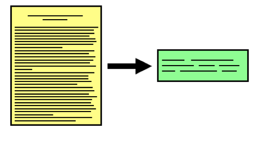
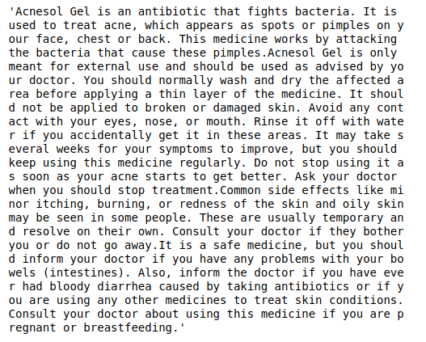

# Text Summarization

## Overview
This text summarization is word frequency based text summarization. This will take a text as input and will return a summary of the text which will contain less number of sentence than in the original text. 

## Perquisites
* Python 3
* NLTK library
* Reglar expression library
* Text editor or IDE

## Dataset
TASK.xlsx

## Steps
1. Clean the dataset
2. Clean the text
    * Remove numbers and special characters
    * Tokenize the text
    * Stem the words
    * Remove stopwords
3. Create dictionary of word frequency
4. Calculate score of each sentence
5. Calculate average score of the text
6. Generate summary

## Output
 
## Tool used

